# Enterprise Architecture Workshop: Secure Application Design

## Descripción del Proyecto

Este proyecto implementa una aplicación segura y escalable desplegada en AWS, siguiendo lo aprendido en clase de arquitectura empresarial y seguridad. La aplicación está compuesta por dos servidores independientes que trabajan en conjunto para proporcionar una solución integral y segura.

## Video Demostrativo
```
https://pruebacorreoescuelaingeduco-my.sharepoint.com/:v:/g/personal/juan_brodriguez_mail_escuelaing_edu_co/EaN2KJqnoaBMgMzT5mDSQXQBou8wlu0aGSILLLx0Q9IEQA?nav=eyJyZWZlcnJhbEluZm8iOnsicmVmZXJyYWxBcHAiOiJPbmVEcml2ZUZvckJ1c2luZXNzIiwicmVmZXJyYWxBcHBQbGF0Zm9ybSI6IldlYiIsInJlZmVycmFsTW9kZSI6InZpZXciLCJyZWZlcnJhbFZpZXciOiJNeUZpbGVzTGlua0NvcHkifX0&e=Lcaikk
```

### Componentes de la Arquitectura

#### Servidor 1: Apache HTTP Server
- **Función**: Servidor web responsable de servir el cliente HTML+JavaScript asíncrono
- **Seguridad**: Configurado con conexión HTTPS/TLS para garantizar la integridad y confidencialidad de los datos
- **Certificados**: Utiliza certificados SSL/TLS generados a través de Let's Encrypt

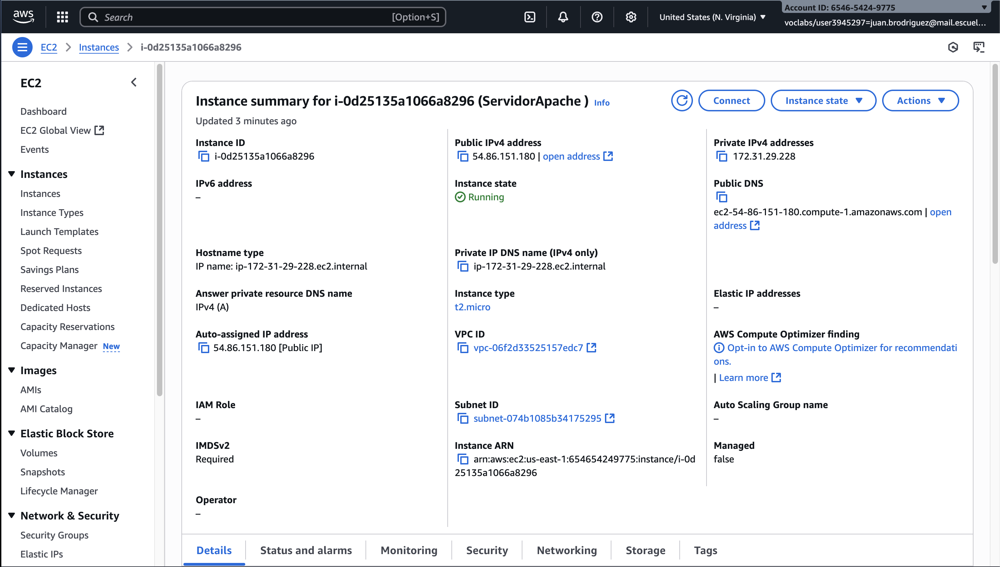

#### Servidor 2: Spring Framework Server
- **Función**: Servidor backend que proporciona servicios RESTful API
- **Seguridad**: Protegido con TLS para comunicación segura cliente-servidor
- **Autenticación**: Sistema de login con contraseñas almacenadas de forma segura mediante hashing

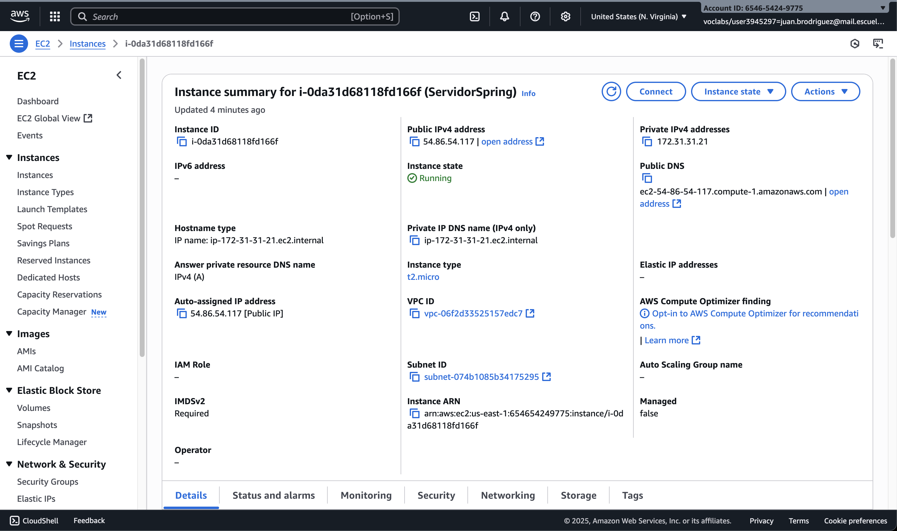


### Características de Seguridad Implementadas

- **Cifrado TLS**: Transmisión segura de datos utilizando certificados Let's Encrypt
- **Cliente Asíncrono**: Implementación HTML+JavaScript con técnicas asíncronas para optimizar el rendimiento
- **Autenticación Segura**: Sistema de login con almacenamiento seguro de contraseñas mediante hashing
- **Despliegue en AWS**: Infraestructura segura y confiable en la nube de Amazon

## Requisitos del Sistema

- Java 17 o superior
- Maven 3.5+ (incluye wrapper mvnw)
- IDE o editor de texto (IntelliJ IDEA, VSCode, Spring Tools Suite, Eclipse)
- Cuenta activa de AWS
- Acceso a terminal/línea de comandos

## Estructura del Proyecto

```
ArepSecureApplicationDesign/
├── README.md                 
├── resources/               
│   ├── 1.png - 43.png      # Screenshots del proceso de configuración
├── springserver/           # Aplicación Spring Boot backend
│   ├── pom.xml            # Configuración Maven
│   └── src/
│       ├── main/java/com/arep/springserver/
│       │   ├── App.java                    # Clase principal Spring Boot
│       │   ├── controller/
│       │   │   ├── AuthController.java     # Endpoints de autenticación
│       │   │   └── SecureController.java   # Endpoints protegidos
│       │   ├── model/
│       │   │   └── User.java              # Modelo de datos usuario
│       │   ├── repository/
│       │   │   └── UserRepository.java    # Acceso a datos JPA
│       │   ├── security/
│       │   │   └── SecurityConfig.java    # Configuración de seguridad
│       │   └── service/
│       │       └── UserService.java       # Lógica de negocio
│       └── resources/
│           └── application.properties     # Configuración Spring Boot
└── .gitignore              
```

## Instalación y Configuración

### 1. Clonación del Repositorio

```bash
git clone https://github.com/juan-beltran0518/ArepSecureApplicationDesign.git
cd ArepSecureApplicationDesign
```

### 2. Ejecución Local del Proyecto Spring Boot

Para probar el servidor Spring Boot localmente:

```bash
cd springserver
mvn clean package -DskipTests
java -jar target/*.jar
```

El servidor estará disponible en:
- **HTTP**: `http://localhost:8080`
- **HTTPS**: `https://localhost:8443` (requiere configuración SSL)

#### Endpoints disponibles:
- `POST /auth/register` - Registro de nuevos usuarios
- `POST /auth/login` - Autenticación de usuarios
- `GET /secure/data` - Endpoint protegido (requiere autenticación)
- `GET /h2-console` - Consola de base de datos H2

### 3. Configuración de Grupos de Seguridad en AWS

Se requieren dos grupos de seguridad independientes para cada servidor:

#### ApacheSecurityGroup
**Reglas de entrada:**
- SSH: Origen Mi IP
- HTTP: Cualquier IPv4 (0.0.0.0/0)
- HTTPS: Cualquier IPv4 (0.0.0.0/0)

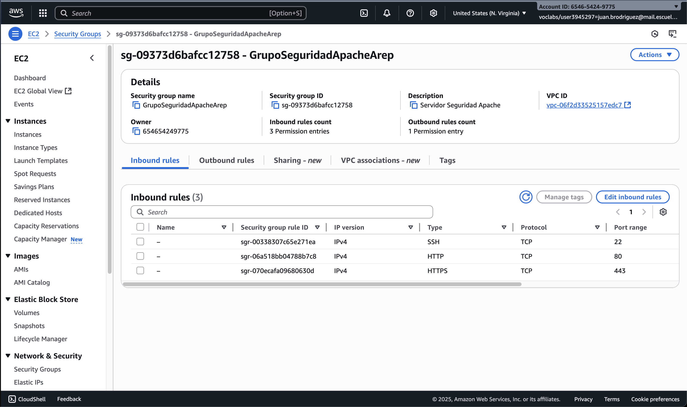

#### SpringSecurityGroup
**Reglas de entrada:**
- SSH: Origen Mi IP
- HTTP: Cualquier IPv4 (0.0.0.0/0)
- HTTPS: Cualquier IPv4 (0.0.0.0/0)
- Puerto 8443: Cualquier IPv4 (para Spring Boot HTTPS)

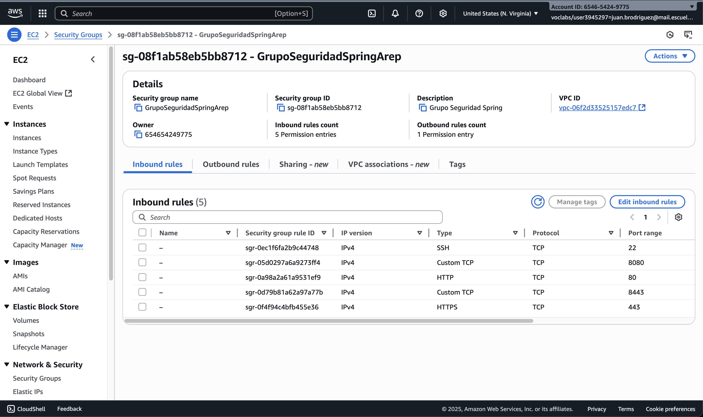

### 3. Creación de Instancias EC2

#### Instancia Apache Server
- **Tipo de instancia**: t2.micro
- **Sistema operativo**: Amazon Linux 2023
- **Grupo de seguridad**: ApacheSecurityGroup
- **Par de claves**: Crear nuevo par de claves

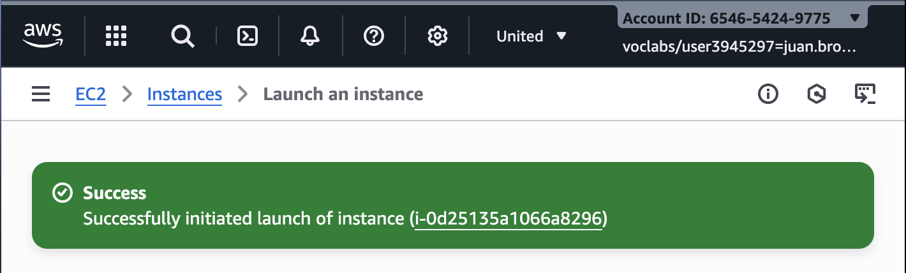
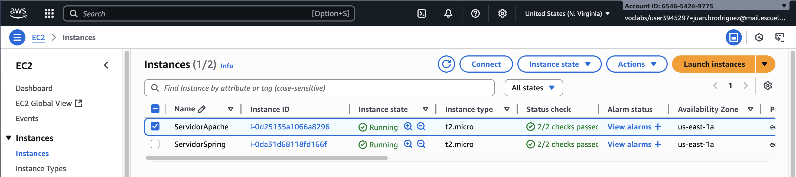
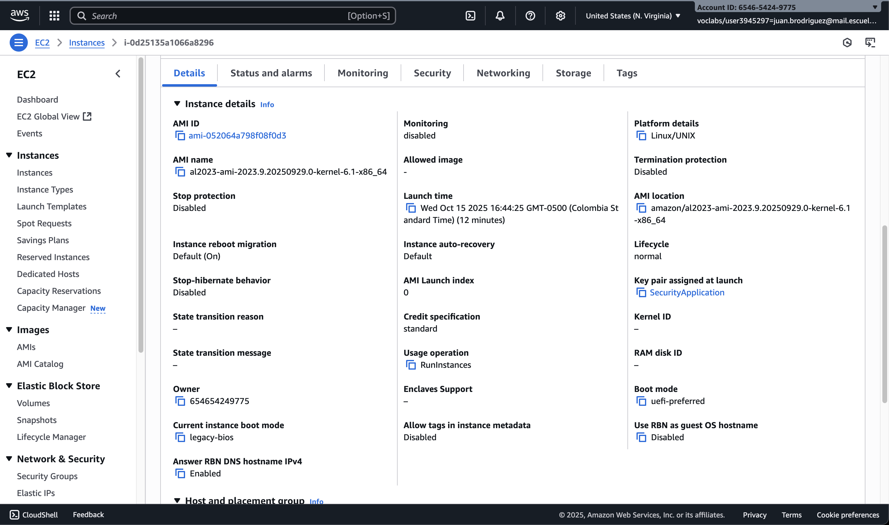

#### Instancia Spring Server
- **Tipo de instancia**: t2.micro
- **Sistema operativo**: Amazon Linux 2023
- **Grupo de seguridad**: SpringSecurityGroup
- **Par de claves**: Crear nuevo par de claves

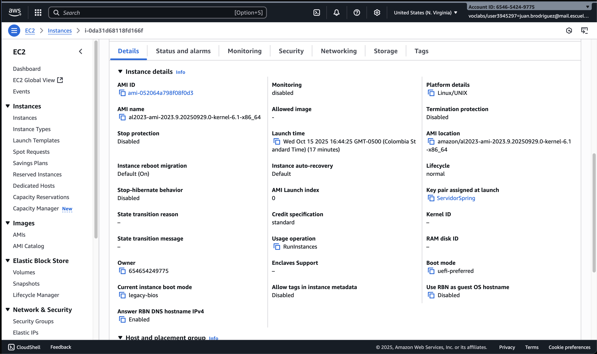
### 4. Configuración DNS

#### Obtención de IPs Públicas
1. Copiar la IP pública de cada instancia desde la consola de AWS

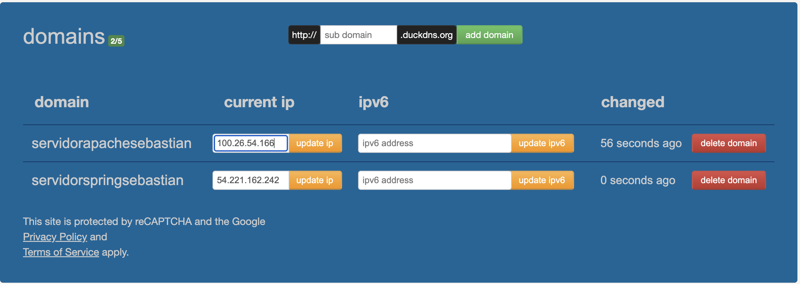

#### Configuración en DuckDNS
1. Acceder a [DuckDNS](https://www.duckdns.org/domains)
2. Vincular cada IP con un dominio personalizado

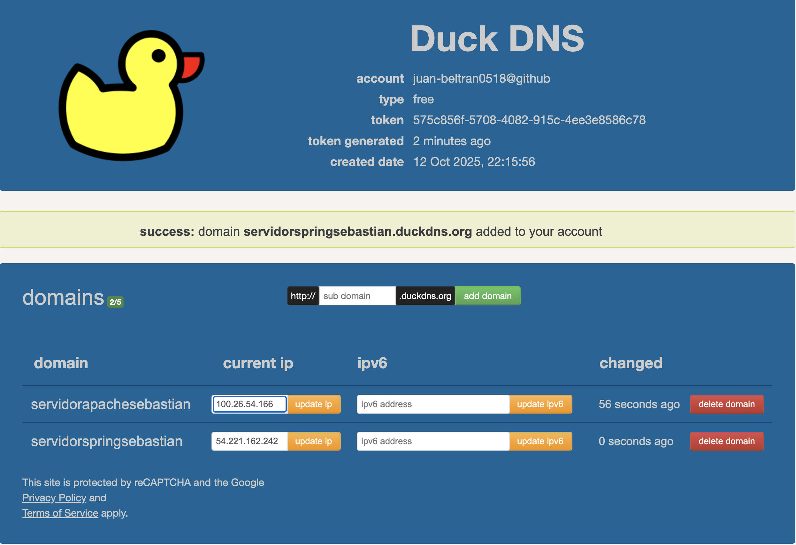

#### Verificación DNS
Verificar la resolución DNS desde terminal local:

```bash
nslookup appivanarep.duckdns.org
nslookup springivanarep.duckdns.org
```

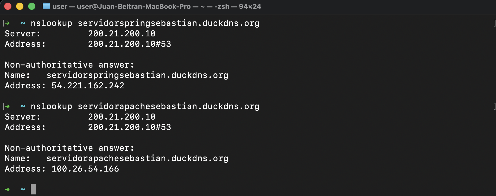

### 5. Configuración del Servidor Apache

#### Conexión SSH y Configuración Inicial

```bash
ssh -i "apache-key.pem" ec2-user@[IP_PUBLICA_APACHE]
```

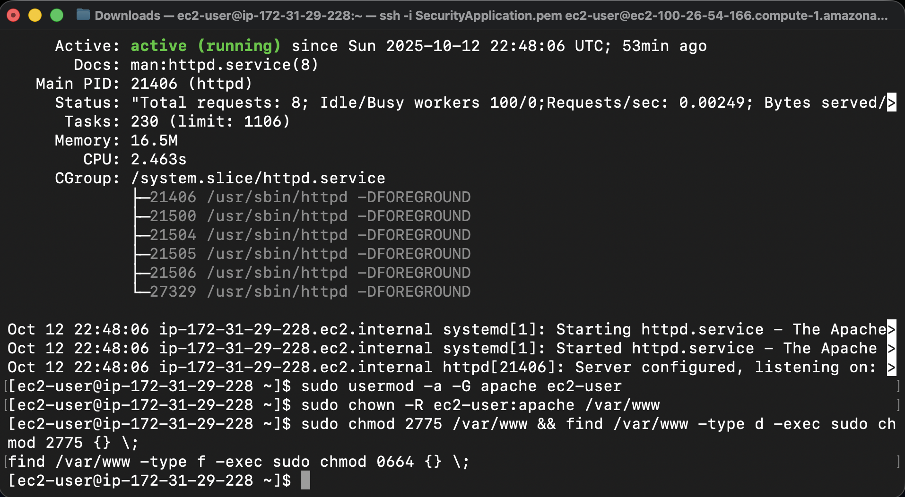

#### Actualización del Sistema e Instalación de Apache

```bash
sudo dnf upgrade -y
sudo dnf install -y httpd
sudo systemctl enable --now httpd
sudo systemctl status httpd
```

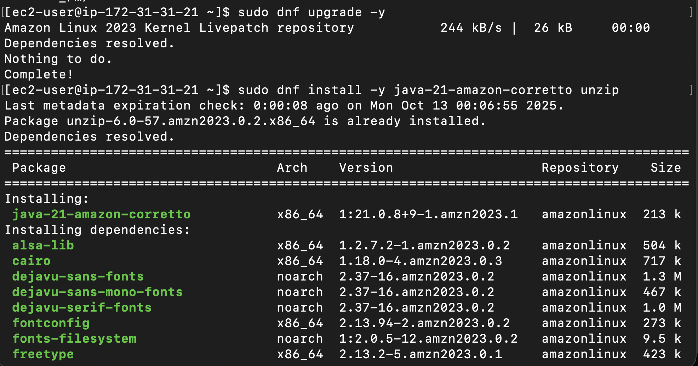

#### Configuración de Permisos

```bash
sudo usermod -a -G apache ec2-user
sudo chown -R ec2-user:apache /var/www
sudo chmod 2775 /var/www && find /var/www -type d -exec sudo chmod 2775 {} \;
find /var/www -type f -exec sudo chmod 0664 {} \;
```

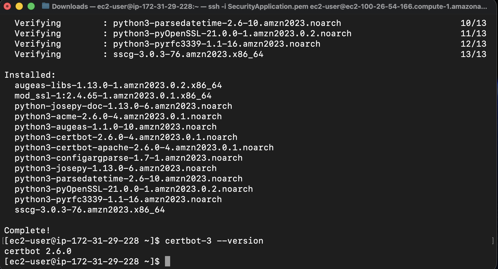

#### Instalación y Configuración de Certificados SSL

```bash
sudo dnf install -y python3-certbot-apache
sudo systemctl stop httpd
sudo certbot-3 certonly --standalone -d appivanarep.duckdns.org \
  -m tu-email@ejemplo.com --agree-tos --no-eff-email
```

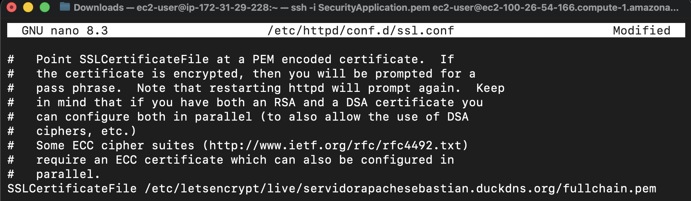
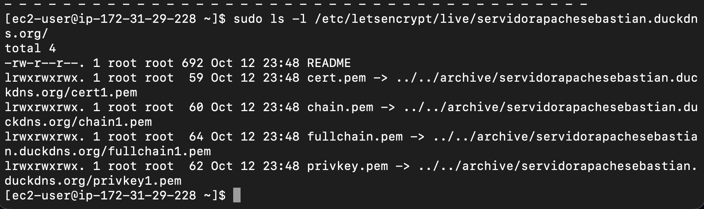
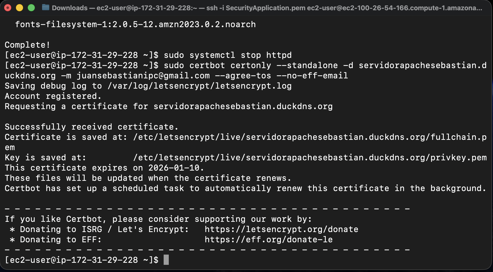

#### Configuración SSL en Apache

```bash
sudo nano /etc/httpd/conf.d/ssl.conf
```

Actualizar las rutas de certificados:

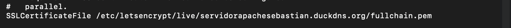
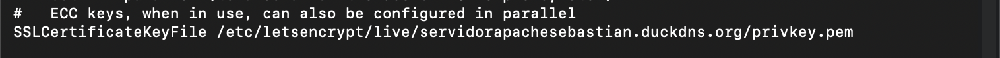


#### Verificación del Servicio

```bash
sudo systemctl start httpd
sudo systemctl enable httpd
sudo systemctl status httpd
```

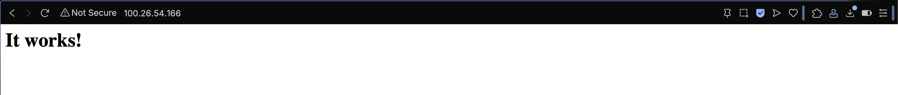

Verificación en navegador:

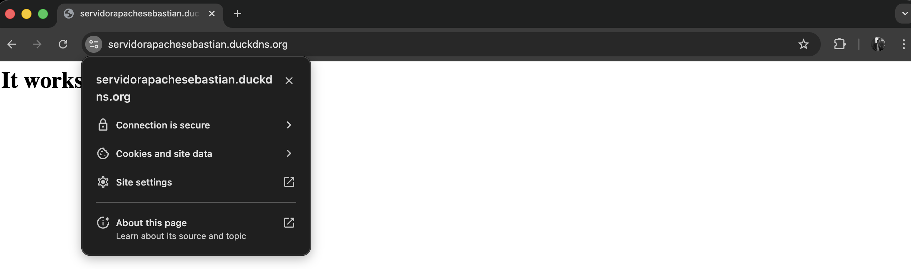

### 6. Configuración del Servidor Spring

#### Conexión SSH y Configuración Inicial

```bash
ssh -i "spring-key.pem" ec2-user@[IP_PUBLICA_SPRING]
sudo dnf upgrade -y
```

#### Instalación de Java y Maven

```bash
sudo dnf install -y java-21-amazon-corretto unzip maven
java -version
mvn -version
```


#### Configuración de Versión Java

```bash
sudo alternatives --config java
sudo alternatives --config javac
```

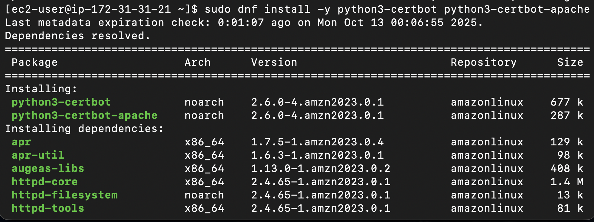

#### Instalación de Certificados SSL

```bash
sudo dnf install -y python3-certbot python3-certbot-apache
sudo certbot-3 certonly --standalone \
  -d springivanarep.duckdns.org \
  -m tu-email@ejemplo.com --agree-tos -n
```

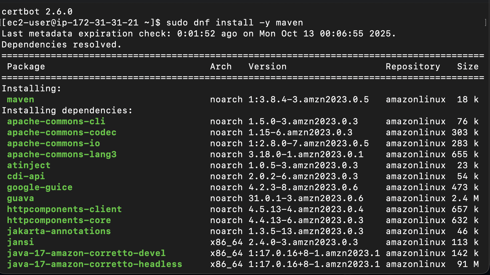
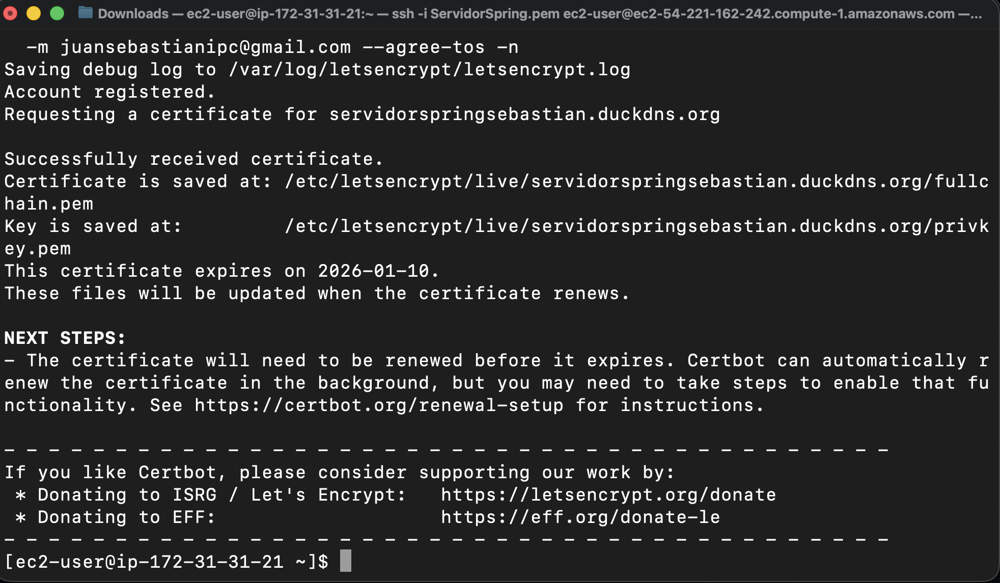

#### Generación del Proyecto Spring

```bash
mvn archetype:generate \
  -DgroupId=com.arep.springserver \
  -DartifactId=springserver \
  -DarchetypeArtifactId=maven-archetype-quickstart \
  -DinteractiveMode=false
```

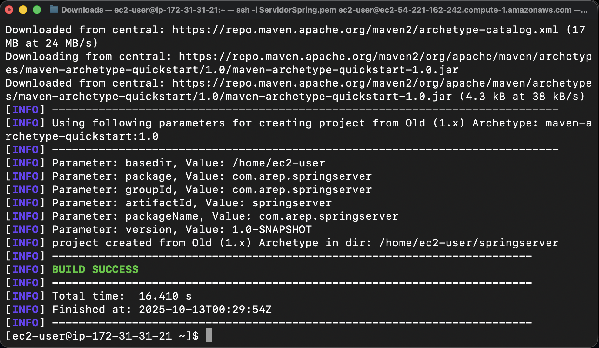

#### Configuración del Proyecto

1. **Modificación del pom.xml**

```
<properties>
  <maven.compiler.source>17</maven.compiler.source>
  <maven.compiler.target>17</maven.compiler.target>
</properties>
<build>
  <plugins>
    <plugin>
      <groupId>org.apache.maven.plugins</groupId>
      <artifactId>maven-compiler-plugin</artifactId>
      <version>3.11.0</version>
    </plugin>
  </plugins>
</build>

```

2. **Creación de la clase Application**

Crear la clase principal de Spring Boot en `src/main/java/com/arep/springserver/App.java`:

```java
package com.arep.springserver;

import org.springframework.boot.SpringApplication;
import org.springframework.boot.autoconfigure.SpringBootApplication;
import org.springframework.web.bind.annotation.GetMapping;
import org.springframework.web.bind.annotation.RestController;

@SpringBootApplication
public class App {

    public static void main(String[] args) {
        SpringApplication.run(App.class, args);
        System.out.println("Hello World!");
    }

    @RestController
    public static class HelloController {
        @GetMapping("/hello")
        public String hello() {
            return "Hello from Spring Boot!";
        }
    }
}
```

3. **Compilación inicial**

```bash
mvn clean package -DskipTests
```


#### Configuración HTTPS en Spring

1. **Creación del directorio keystore**

```bash
sudo mkdir -p /opt/springserver
sudo chown ec2-user:ec2-user /opt/springserver
```

2. **Conversión de certificados a formato PKCS#12**

```bash
sudo openssl pkcs12 -export \
  -in /etc/letsencrypt/live/springivanarep.duckdns.org/fullchain.pem \
  -inkey /etc/letsencrypt/live/springivanarep.duckdns.org/privkey.pem \
  -out /opt/springserver/keystore.p12 \
  -name tomcat \
  -password pass:root1234
```


3. **Configuración application.properties**

Crear el directorio de recursos y el archivo de configuración:

```bash
mkdir -p src/main/resources
nano src/main/resources/application.properties
```

Contenido del archivo `application.properties`:

```properties
# Configuración del servidor
server.port=8443
server.address=0.0.0.0

# Configuración SSL/TLS
server.ssl.enabled=true
server.ssl.key-store=file:/opt/springserver/keystore.p12
server.ssl.key-store-type=PKCS12
server.ssl.key-store-password=root1234
server.ssl.key-alias=tomcat

# Configuración de Base de Datos H2
spring.datasource.url=jdbc:h2:file:/opt/springserver/data/testdb
spring.datasource.driver-class-name=org.h2.Driver
spring.datasource.username=sa
spring.datasource.password=

# Configuración JPA/Hibernate
spring.jpa.database-platform=org.hibernate.dialect.H2Dialect
spring.jpa.hibernate.ddl-auto=update

# Configuración H2 Console
spring.h2.console.enabled=true
spring.h2.console.settings.web-allow-others=true

# Configuración de Logging
logging.level.org.springframework=INFO
```

**Descripción de las configuraciones:**

- `server.port=8443`: Puerto estándar para HTTPS
- `server.ssl.enabled=true`: Habilita SSL/TLS en el servidor
- `server.ssl.key-store`: Ruta al archivo keystore con certificados
- `spring.datasource.url`: Base de datos H2 persistente
- `spring.jpa.hibernate.ddl-auto=update`: Actualización automática de tablas
- `spring.h2.console.enabled=true`: Habilita consola web de H2

#### Estructura de la API

Creación de la estructura de paquetes:

```bash
mkdir -p src/main/java/com/arep/springserver/controller
mkdir -p src/main/java/com/arep/springserver/model
mkdir -p src/main/java/com/arep/springserver/repository
mkdir -p src/main/java/com/arep/springserver/security
mkdir -p src/main/java/com/arep/springserver/service
```

#### Implementación de Componentes

1. **Controllers**: AuthController.java y SecureController.java
2. **Models**: User.java
3. **Repository**: UserRepository.java
4. **Security**: SecurityConfig.java
5. **Service**: UserService.java


#### Configuración Base de Datos H2

La configuración de H2 ya está incluida en el archivo `application.properties` mostrado anteriormente. Esta configuración permite:

- Base de datos persistente en `/opt/springserver/data/testdb`
- Consola web accesible para administración
- Actualización automática del esquema de base de datos

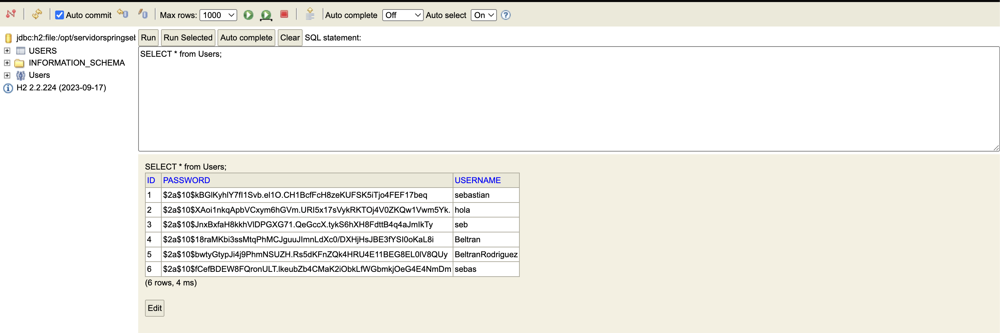

#### Compilación y Ejecución

```bash
mvn -U clean package -DskipTests
java -jar target/*.jar
```

## Pruebas y Verificación

### Pruebas de API con Postman

1. **Registro de usuario**
2. **Autenticación con Basic Auth**

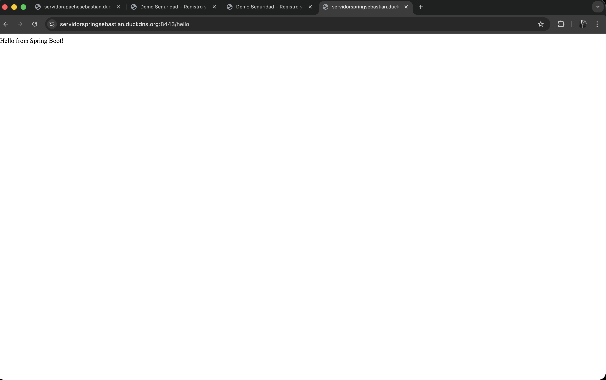
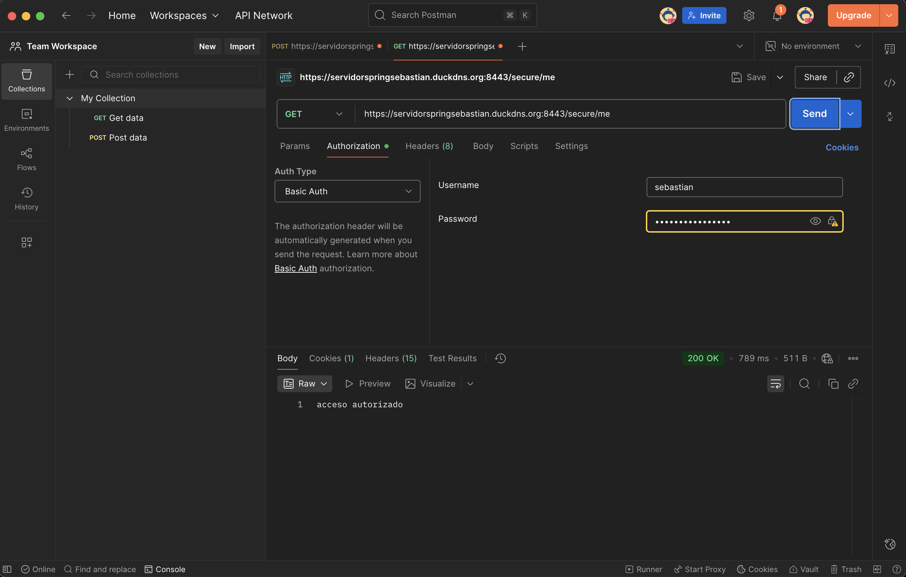

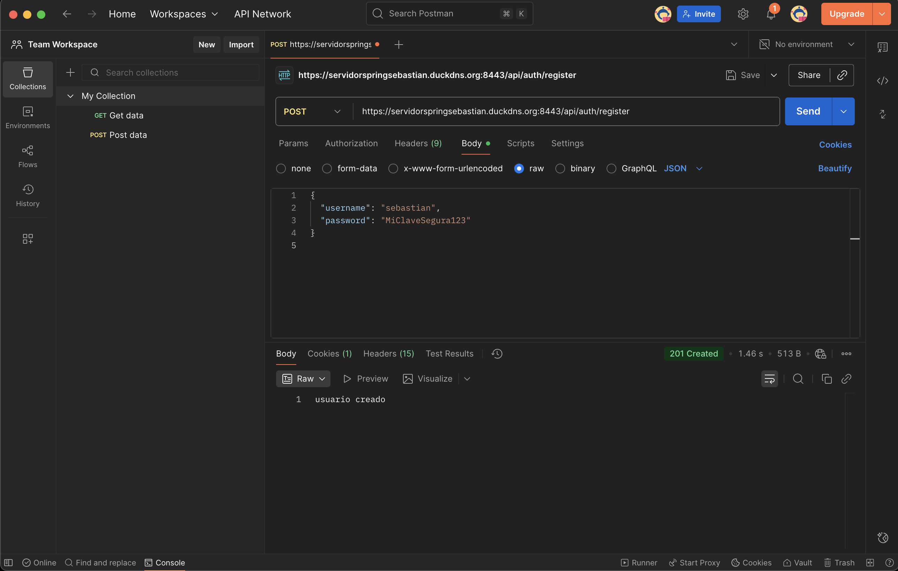
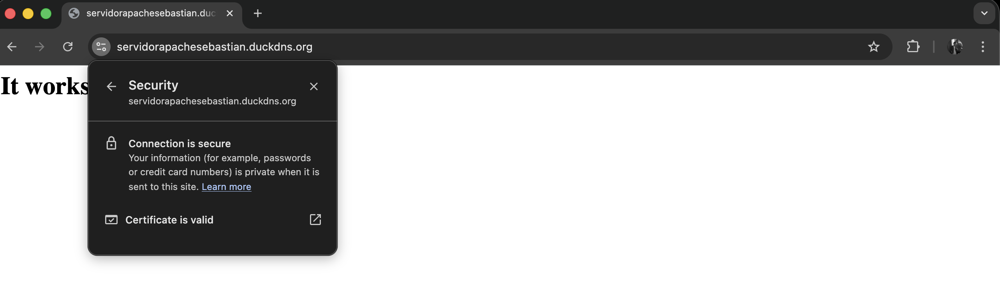
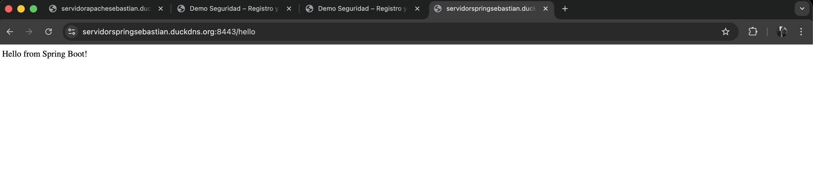


### Pruebas en Navegador

Verificación de códigos de respuesta y funcionalidad:


### Verificación de Persistencia

Acceso a consola H2:
- URL: `https://springivanarep.duckdns.org:8443/h2-console`
- Driver Class: `org.h2.Driver`
- JDBC URL: `jdbc:h2:file:/opt/springserver/data/testdb`
- User Name: `sa`
- Password: (en blanco)


## Autor

**Juan Beltrán** - [juan-beltran0518](https://github.com/juan-beltran0518)


## Referencias

- [AWS EC2 LAMP Stack Guide](https://docs.aws.amazon.com/linux/al2023/ug/ec2-lamp-amazon-linux-2023.html)
- [Spring Security Guide](https://spring.io/guides/gs/securing-web)
- [Let's Encrypt Documentation](https://letsencrypt.org/docs/)
- [Spring Boot SSL Configuration](https://docs.spring.io/spring-boot/docs/current/reference/html/howto.html#howto.webserver.configure-ssl)

